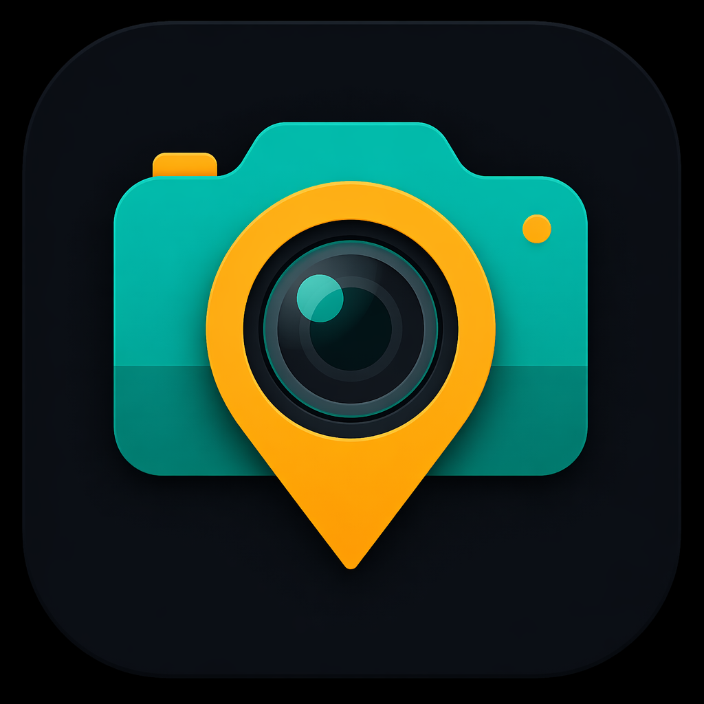
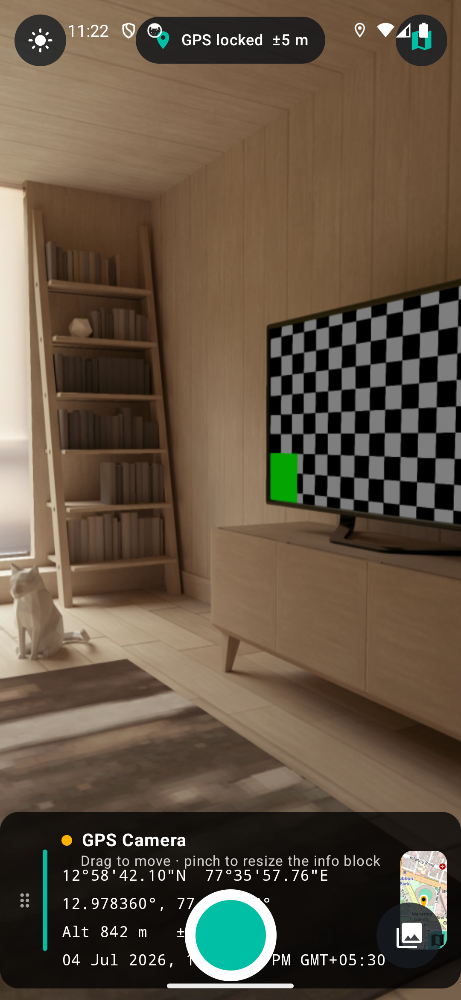
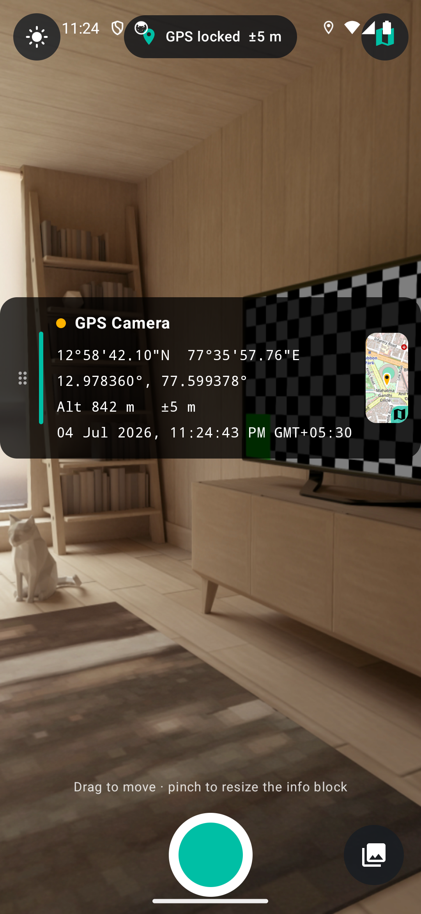
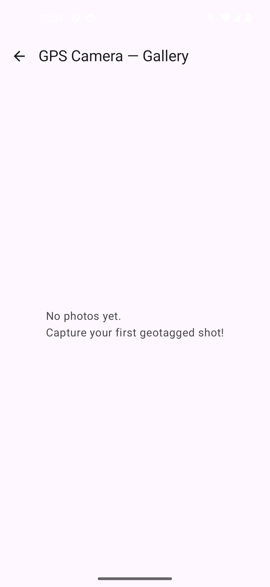

# 📍 GPS Camera

A fast, native **Android GPS camera** that burns your **exact location onto every photo** and files each shot into its own album — with a live **mini-map**, one-tap **Open in Maps**, and a stamp you can **drag, move and resize** before you shoot.

<p align="center">
  
</p>

<p align="center">
  <a href="https://naveenneog.github.io/GpsCamera/">🌐 Website</a> ·
  <a href="https://github.com/naveenneog/GpsCamera/releases/latest">⬇️ Download APK</a>
</p>

---

## ✨ Features

- **📸 Geotagged capture** — every photo is stamped with latitude/longitude (DMS + decimal), altitude, accuracy, reverse-geocoded address and a timestamp.
- **🗺️ Live mini-map** — a real OpenStreetMap thumbnail of your spot is drawn onto the photo and shown live on the viewfinder.
- **👆 Tap to open in Maps** — the map thumbnail and the map button open the exact coordinates in Google Maps (or any maps app).
- **🧲 Move & resize the stamp** — drag the info block anywhere on the frame and pinch to resize *before* you capture; the photo is burned exactly as you arranged it.
- **🧭 Standards-compliant EXIF** — GPS latitude/longitude/altitude/timestamp + a clickable Maps URL are written into the JPEG, so Google Photos, Lightroom, etc. place it on a map automatically.
- **🗂️ Dedicated album** — shots are saved to **`Pictures/GPSCamera`** and browsable in an in-app gallery.
- **🌗 Day & night** — light/dark theme with a one-tap toggle (defaults to your system setting).
- **🛡️ Resilient location** — merges Google Play Services *fused* location **and** the platform GPS/network providers, so it works even without Google Play Services.
- **⚡ Fast & native** — Kotlin + Jetpack Compose + CameraX, no heavyweight frameworks.

## 📷 Screenshots

| Live viewfinder + mini-map | Move / resize the stamp | Gallery (light theme) |
|---|---|---|
|  |  |  |

## 🏗️ Tech stack

| Area | Choice |
|---|---|
| Language / UI | Kotlin, Jetpack Compose (Material 3) |
| Camera | CameraX (`camera-core`, `camera2`, `lifecycle`, `view`) |
| Location | `FusedLocationProviderClient` + platform `LocationManager` |
| Metadata | AndroidX `ExifInterface` |
| Maps | OpenStreetMap raster tiles (no API key) |
| Min / target SDK | 26 / 35 |

## 🚀 Build

Requirements: JDK 17 and the Android SDK.

```bash
# Debug APK
./gradlew :app:assembleDebug

# Signed (debug-key) release APK
./gradlew :app:assembleRelease
```

The APK is produced at `app/build/outputs/apk/<type>/`.

## ✅ Tests

The core is covered by a comprehensive automated suite so the app stays regression-free.

```bash
# Pure-JVM unit tests (GPS math, EXIF rationals, map tiling, stamp text)
./gradlew :app:testDebugUnitTest

# On-device instrumented tests (EXIF read-back, stamping, MediaStore storage)
./gradlew :app:connectedDebugAndroidTest
```

- **Unit:** `GpsFormatTest`, `SlippyMapTest`, `PhotoSaverNamingTest`
- **Instrumented:** `ExifWriterInstrumentedTest`, `PhotoStamperInstrumentedTest`, `PhotoSaverInstrumentedTest`

## 🧱 Architecture

```
com.gpscamera
├── model/GeoFix               immutable GPS fix
├── util/GpsFormat             DMS / EXIF-rational / stamp-text (pure, tested)
├── util/SlippyMap            web-mercator tile math + maps URLs (pure, tested)
├── location/LocationRepository fused + platform providers, reverse geocoding
├── map/StaticMapProvider      fetch + stitch OSM tiles, draw pin
├── camera/PhotoStamper        burns the info panel + map onto the bitmap
├── camera/ExifWriter          writes GPS EXIF + Maps URL
├── camera/PhotoSaver          saves JPEG to Pictures/GPSCamera (MediaStore)
├── camera/GalleryRepository   reads the album back
└── ui/…                       Compose screens + MainViewModel
```

## 🎨 Logo

The app icon was generated with **Azure AI Foundry `gpt-image-2`** (see `tooling/generate_logo.ps1`).

## 📄 License

[PolyForm Noncommercial License 1.0.0](LICENSE) — free for personal and other noncommercial use.

Map data © OpenStreetMap contributors.
